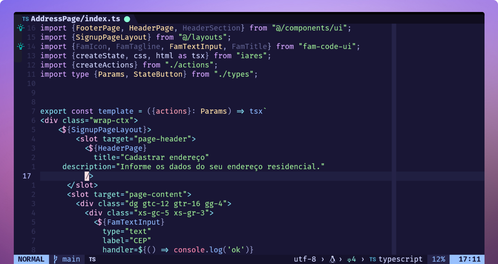

# Ncode

<figure><figcaption></figcaption></figure>

#### Characteristics?

* _Performance_: Ncode uses only 200mb of RAM.
* _Speed_: Open your projects in milliseconds with no lag.
* Extensible: Easy, effortless customization.

Ncode is based on Neovim and entirely written in Lua.

#### Why use Ncode?

Stop suffering with slow editors! Ncode is simple, lightweight, and incredibly fast. Perfect for everyday coding needs.

#### Who is Ncode for?

Anyone who needs a fast, customizable editor. With thousands of plugins, you can easily set it up, even if you're new to Neovim and Lua. Ncode supports web, mobile, and desktop development.

Ready for a smooth coding experience? Try Ncode today!
